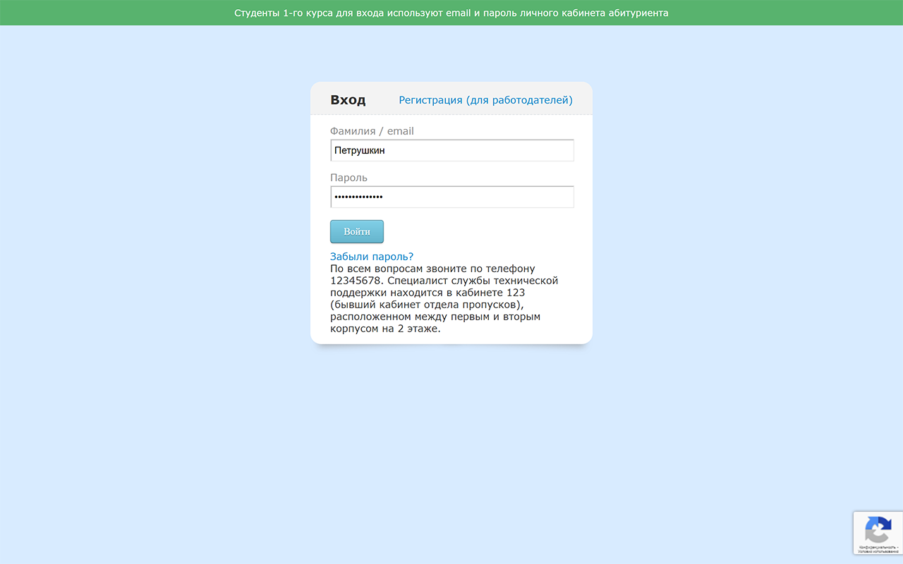
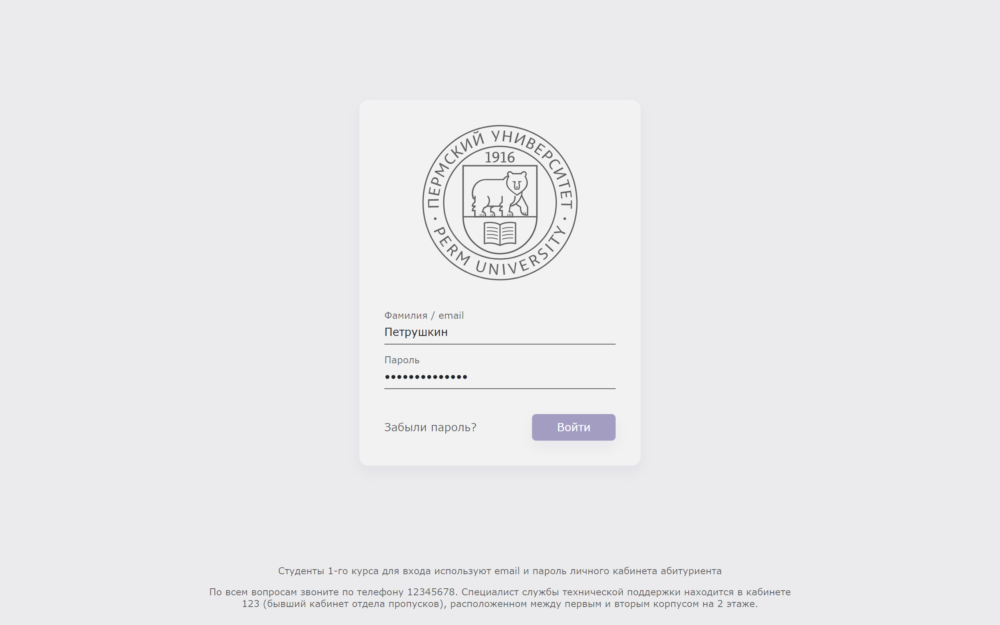
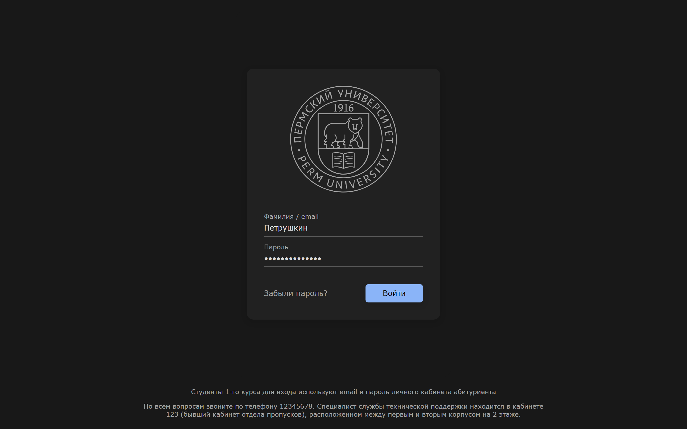
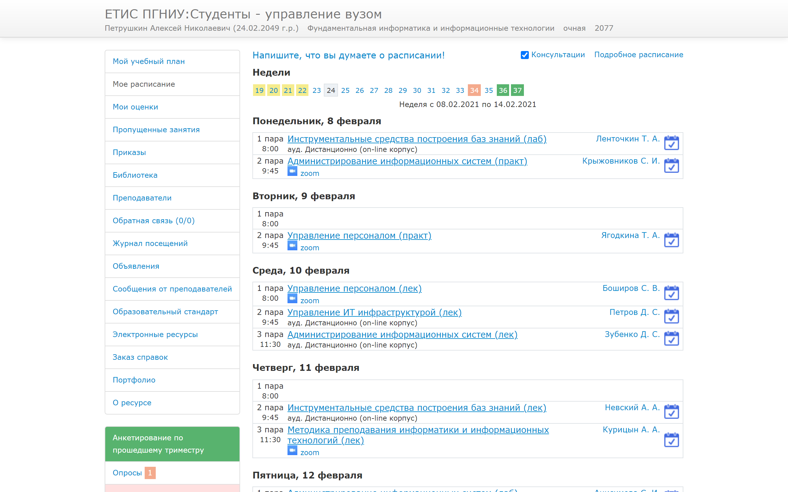
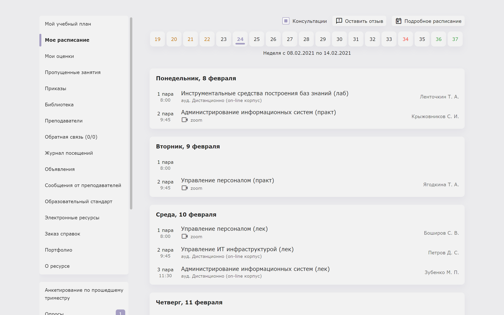
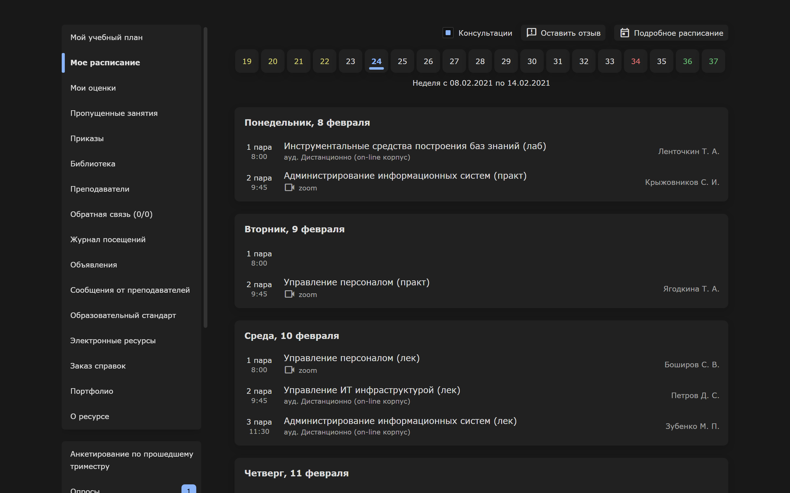

# ЕТИС 2.0

  
  
  

  
  
  

Браузерное расширение, меняющее дизайн [ЕТИСа](https://student.psu.ru/), сайта электронного журнала студентов Пермского государственного национального исследовательского университета.

# Установка

Поддерживаются браузеры на базе Chromium.

Список протестированных браузеров:
- Google Chrome
- Microsoft Edge
- Opera

**Скачать:**
- [Из Интернет-магазина Chrome](https://chrome.google.com/webstore/detail/%D0%B5%D1%82%D0%B8%D1%81-20/lnggbapghkjneppcomlegoocpdeaiafa)

# Обратная связь

Если у вас возникли вопросы или предложения по улучшению расширения, обратитесь в нашу службу технической поддержки:

Владислав - https://t.me/landvermess

Наш телеграм-канал - https://t.me/etis2
